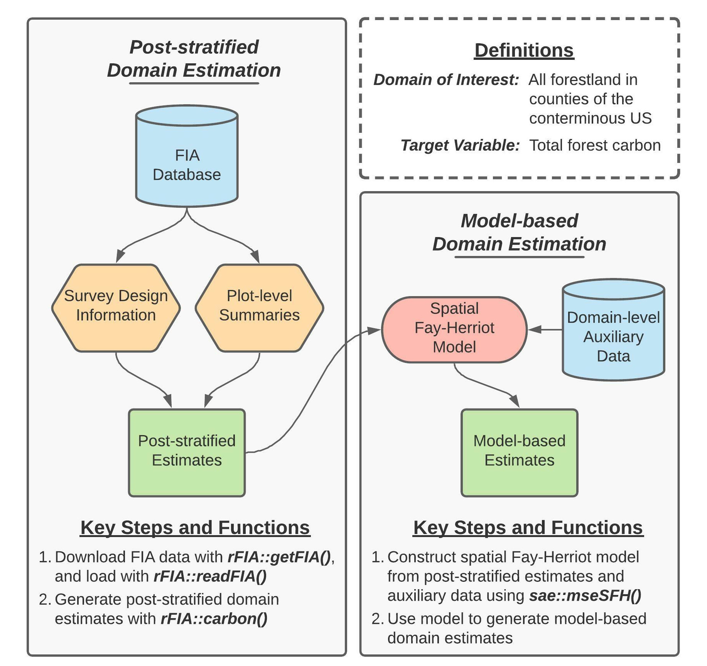

# Introduction

The purpose of this document is to provide a detailed tutorial of the code used to implement the first case study presented in Stanke, Finley, Domke (2021), “Simplifying small area estimation with rFIA: a demonstration of tools and techniques”. Here, we use the post-stratified estimators implemented in rFIA to estimate current forest carbon stocks within counties across the conterminous US (CONUS), and develop a domain-level spatial Fay-Herriot model to couple these post-stratified estimates with auxiliary climate variables and improve precision of estimated carbon stocks.

``` {r, echo=FALSE, fig.align='center', out.width='85%'}

```

Figure 1 (re-printed above for convenience) provides a concept map illustrating key steps, functions, and workflows used in the development of our spatial Fay-Herriot model of forest carbon stocks in conterminous US. Here, blue cylinders represent data inputs, green rectangles represent domain estimates, and orange hexagons represent intermediate data products. 

In words, this process consists consists of two primary stages: 

1. Produce post-stratified estimates of carbon stocks and associated variances for all forestland in each county (i.e., our domains of interest) using rFIA.
2. ``Smooth'' post-stratified estimates using a model constructed from domain-average climate variables and spatial random effects to improve precision of estimated quantities within each domain.

\hfill\break


# Getting Started

## Downloading code and data from GitHub
Data and code required to replicate our workflows are available on [GitHub](https://github.com/hunter-stanke/FGC_rFIA_SAE). If you are familiar with Git, simply clone this repository on your local machine to get started. If you are not familiar, click on the `Code` dropdown in the upper-right hand corner of the landing page [here](https://github.com/hunter-stanke/FGC_rFIA_SAE) (just left of the `About` section), and you can download the full repository as a zip file.  

__*Important:*__ we house code and data associated with both case studies presented in this manuscript in the GitHub repository referenced above. Everything you need for this case study (estimating county-level forest carbon stocks) can be found in the `carbon/` directory. 

   + Source code is located in `carbon/src/`
   + FIA and PRISM data are downloaded from public servers by `getFIA.R` and `getPRISM.R`, respectively. These data will be stored in the `carbon/data/` directory once downloaded. 
   + Results (i.e., population estimates) generated by source code are stored in `carbon/results/`
   + *To run*: source scripts in the following order (1) `getFIA.R`, (2) `directEstimates.R`, (3) `fitModel.R`. Please see the "Bonus Code" section at the end of this document for details regarding the `getPRISM.R` script (used to download county shapefiles and climate data).

## Installing dependencies
The analyses detailed herein are conducted using the R programming language, and hence require a working installation of R (version 4.0.0 or newer). You can find instructions and tutorials for install R [here](https://rstudio-education.github.io/hopr/starting.html). In addition to base R, the following add-on packages are required: `rFIA`, `sae`, `dplyr`, `sf`, and `here`. These packages (and their respective dependencies) can be installed with:
``` {r, echo = TRUE, eval = FALSE}
## Install dependencies
install.packages(c("rFIA", "sae", "dplyr", "sf", "here"))

## Load packages
library(rFIA)
library(sae)
library(dplyr)
library(sf)
library(here)
```


## Downloading FIA data
Next, we must download an appropriate subset of the FIA Database from the [FIA DataMart](https://apps.fs.usda.gov/fia/datamart/CSV/datamart_csv.html). The easiest way to accomplish this is using the `getFIA()` function from the rFIA R package. In the code that follows, we download the subset of the FIA Database for all states in the coterminous US, and save these data to a local directory on our computer (*your-project-directory*/carbon/data/FIA/):
``` {r, echo = TRUE, eval = FALSE}
## Download/save FIA data for all states in the lower 48
# Vector of states
lower48 <- c('AL', 'AZ', 'AR', 'CA', 'CO', 'CT', 'DE', 'FL', 'GA', 'ID', 
             'IL', 'IN', 'IA', 'KS', 'KY', 'LA', 'ME', 'MD', 'MA', 'MI',
             'MN', 'MS', 'MO', 'MT', 'NE', 'NV', 'NH', 'NJ', 'NM', 'NY',
             'NC', 'ND', 'OH', 'OK', 'OR', 'PA', 'RI', 'SC', 'SD', 'TN', 
             'TX', 'UT', 'VT', 'VA', 'WA', 'WV', 'WI', 'WY')
# Download
rFIA::getFIA(states = lower48,
             dir = here::here('carbon/data/FIA/'),
             load = FALSE)
```
**_Important_: data downloaded in the code presented above are large (FIA data > 50GB)**. Only download once (all data will be saved on disk), and consider subsetting the spatial extent (i.e., select a handful of states, for example with `lower48 = c('WA', 'OR')`) if you would prefer to avoid downloading this much data.


\clearpage

# Post-stratified estimates of forest carbon with rFIA
### Loading FIA data into R
Before we can use rFIA's estimator functions (e.g., `carbon()`), we must first use `readFIA()` to load our FIA data into R, or alternatively, set up a "remote" FIA data object. This "remote" option is particularly useful when our area(s) of interest span multiple states, as it allows rFIA's estimator functions to split FIA data into small chunks and process each individually, thereby allowing us to work with large amounts of FIA data without overloading our computer's RAM. 

As we are working with all states in the lower 48 here (~50 GB of data), we elect to set up a "remote" FIA data object by specifying `inMemory=FALSE` in the call to `readFIA()`:
``` {r, eval=FALSE, echo=TRUE}
db <- rFIA::readFIA(dir = here::here('carbon/data/FIA'),
                    inMemory = FALSE)
```
where `dir` references the directory where we have saved the FIA data we downloaded with `getFIA()` (example above).


### Selecting a most recent subset
Next we take a temporal subset of our FIA data, i.e., we select data associated with the most recent inventories available in each state. The `clipFIA()` function handles spatial and temporal queries, and we specify a most recent subset by setting `mostRecent=TRUE`:
``` {r, eval=FALSE, echo=TRUE}
db <- rFIA::clipFIA(db,
                    mostRecent = TRUE)
```


### Estimating forest carbon stocks county-by-county
Finally, we use the `carbon()` function to produce post-stratified estimates of forest carbon stocks on a county-by-county basis:
``` {r, eval=FALSE, echo=TRUE}
# Load shapefile of county boudaries
counties <- sf::st_read(here::here('carbon/data/counties_climate/')) %>%
   # Albers Equal Area NA
   sf::st_transform(crs = 'ESRI:102008') %>%
   # Compute area of each county, sq m --> ha
   dplyr::mutate(ha = as.numeric(sf::st_area(.) / 10000)) %>%
   # A unique ID for counties
   dplyr::mutate(county.id = paste(STATEFP, COUNTYFP, sep = '_'))

# Produce post-stratified estimates of total forest carbon 
# within each county boundary
pop.est <- rFIA::carbon(db, 
                        polys = counties,
                        totals = TRUE,
                        variance = TRUE,
                        byPool = FALSE) # Sum across carbon pools
```
We use a spatial dataset (i.e., county boundary shapefile) to delineate counties here. We tell the `carbon()` function to treat counties as unique domains by handing our spatial county dataset to the `polys` argument. If we omit the `polys` argument, rFIA will treat all states in our remote FIA data object, `db`, as a single domain of interest. Importantly, our spatial dataset contains county-average climate variables that will be used as auxiliary variables in the development of our Fay-Herriot model in subsequent steps. By handing our spatial dataset to the `carbon()` function, all variables in the spatial dataset are automatically appended to the resulting dataset (i.e., `pop.est` contains post-stratified estimates of forest carbon, as well as auxiliary climate variables).

We could also tell the `carbon()` function to treat counties as unique domains by specifying `grpBy=COUNTYCD`, where `COUNTYCD` is a county identifier (FIPS code) defined in the FIA database. Both approaches will yield the same results, but we take the spatial approach here to improve the generality of this code for adaptation by subsequent users.

Finally, we specify `byPool = FALSE` as `carbon()` estimates carbon stocks grouped by IPCC forest carbon pools by default (i.e., defaults to `byPool = TRUE`). As we are interested in *total* forest carbon in this application, we specify `byPool = FALSE` and thereby tell `carbon()` to sum carbon stocks across all IPCC pools. 

\hfill\break


# Fitting the spatial Fay-Herriot model with sae
Before we can use the sae package to fit a spatial Fay-Herriot model, we need to get data containing our post-stratified estimates of forest carbon stocks and auxiliary climate data into an appropriate format, and construct a spatial proximity matrix to identify adjacency among counties. 

### Data wrangling and preparation
First, we prepare the data object containing our post-stratified estimates of forest carbon stocks and auxiliary climate variables by (1) converting population totals to population means (dividing by known area of counties), (2) convert units of our carbon variables from tons carbon per hectare to tons CO2-equivalent per hectare, (3) computing the relative standard error of resulting post-stratified population estimates, and (4) scaling our climate predictors:
``` {r, eval=FALSE, echo=TRUE}
pop.est <- pop.est %>%
  # Forest carbon unit conversion
  dplyr::mutate(carb = CARB_TOTAL / ha / (12/44),
                carb.var = CARB_TOTAL_VAR / (ha^2) / ((12/44)^2)) %>%
  # Compute relative standard error
  dplyr::mutate(carb.rse = sqrt(carb.var) / carb) %>%
  # Take log of mean annual precipitation
  dplyr::mutate(map = log(map)) %>%
  # Center and scale ppt and tmean
  dplyr::mutate(mat = scale(mat),
                map = scale(map)) 
```


### Constructing a spatial proximity matrix
Finally, we must construct a row-standardized proximity matrix that indicates adjacency of counties within the coterminous US, where row-standardization indicates that all "neighbors" of a particular domain are assigned equal weight. For those unfamiliar with such constructs, please see slides 19-25 [here](https://www.depts.ttu.edu/geospatial/center/gist4302/documents/lectures/Spring%202014/lecture6.pdf).
``` {r, eval=FALSE, echo=TRUE}
# Function to identify neighbors using rook method
st_rook <- function(a, b = a){
   sf::st_relate(a, b, pattern = "F***1****")
} 

## Sparse binary predicate --> dense binary matrix
prox.mat <- counties %>% 
  dplyr::filter(county.id %in% pop.est$county.id) %>%
  dplyr::mutate(NB_QUEEN = st_rook(.))
prox.mat <- as.matrix(prox.mat$NB_QUEEN)

## Binary matrix to proximity matrix required by `sae`
for (i in 1:nrow(prox.mat)) {
  ## Number of neighbors
  nn <- sum(prox.mat[i,])
  ## Weight each neighbor equally
  prox.mat[i,] <- prox.mat[i,] / nn
}

## Replace NAs w/ zero
prox.mat[is.na(prox.mat)] <- 0
```


### Fitting the spatial Fay-Herriot model
We may now combine our post-stratified population estimates, auxiliary climate variables, and spatial proximity matrix to fit a spatial Fay-Herriot model, using the `mseSFH()` function from the sae package:
``` {r, eval=FALSE, echo=TRUE}
# A design matrix
design.mat <- cbind(as.factor(pop.est$county.id),
                    pop.est$mat,
                    pop.est$map)
# Fit the model
mod <- sae::mseSFH(carb ~ design.mat, 
                   vardir = carb.var,
                   proxmat = prox.mat,
                   method = 'REML',
                   data = pop.est)
```
Here `design.mat` is a $2957 \times 2$ matrix of climate predictors (2957 counties, 2 predictors), `carb` is a vector of post-stratified estimates of county-level forest carbon stocks and `carb.var` are the associated post-stratified variance estimates (assumed known for the purposes of the Fay-Herriot model). 

### Extracting predictions
Finally, we can extract "smoothed" model-based domain estimates (`pred`) and associated MSE (`pred.mse`) from our sae model object, and compute the ratio of the model-based RMSE to the post-stratified standard error estimates for each county (`ser`):
``` {r, eval=FALSE, echo=TRUE}
# Appending EBLUP estimates to dataframe w/ post-stratified estimates
pop.est$pred <- mod$est$eblup
pop.est$pred.mse <- mod$mse
pop.est$pred.rse <- sqrt(pop.est$pred.mse) / pop.est$pred

# Ratio of smoothed RMSE to post-stratified SE
pop.est$ser <- sqrt(pop.est$pred.mse) / sqrt(pop.est$carb.var)
```

\hfill\break

# Bonus code: Downloading and processing PRISM data in R
While only the code above is required to replicate the analyses presented in the associated manuscript (Stanke, Finley, Domke (2021)), we have included this additional section that provides details regarding our construction of the `counties` spatial dataset used above for users interested in extending our analyses. All code which follows has been adapted from the script located in `/carbon/src/getPRISM.R`.

### Install dependencies
Before we begin, we will need a few more packages: `prism`, `tigris`, and `stars`. 
``` {r, eval=FALSE, echo=TRUE}
## Install new packages and dependencies
install.packages(c('prism', 'tigris', 'stars'))

## Load packages
library(prism)
library(tigris)
library(stars)
```


### Download climate data from PRISM and load into R
Now we will use the `prism` package to download 30-year temperature and precipitation normals released by the [PRISM Group](https://prism.oregonstate.edu/). These data are defined on an 800m grid spanning the CONUS, and are distributed in raster format:
``` {r, eval=FALSE, echo=TRUE}
# Where should climate rasters be stored?
options(prism.path = here::here('carbon/data/PRISM/'))

# Download precipitation normals
prism::get_prism_normals(type = "ppt", 
                  resolution = '800m',
                  annual = TRUE, 
                  keepZip = FALSE)

# Download temperature normals
prism::get_prism_normals(type = "tmean", 
                  resolution = '800m', 
                  annual = TRUE, 
                  keepZip = FALSE)

# Read precipitation normals
ppt <- stars::read_stars(
   here::here('carbon/data/PRISM/PRISM_ppt_30yr_normal_800mM3_annual_bil
               /PRISM_ppt_30yr_normal_800mM3_annual_bil.bil')
   )

# Read temperature normals
tmean <- stars::read_stars(
   here::here('carbon/data/PRISM/PRISM_tmean_30yr_normal_800mM3_annual_b
              il/PRISM_tmean_30yr_normal_800mM3_annual_bil.bil')
   )
```


### Download county boundaries
Next, we download a spatial dataset that delineates county boundares for all states in coterminous US:
``` {r, eval=FALSE, echo=TRUE}
# Vector of states
lower48 <- c('AL', 'AZ', 'AR', 'CA', 'CO', 'CT', 'DE', 'FL', 'GA', 'ID', 
             'IL', 'IN', 'IA', 'KS', 'KY', 'LA', 'ME', 'MD', 'MA', 'MI',
             'MN', 'MS', 'MO', 'MT', 'NE', 'NV', 'NH', 'NJ', 'NM', 'NY',
             'NC', 'ND', 'OH', 'OK', 'OR', 'PA', 'RI', 'SC', 'SD', 'TN', 
             'TX', 'UT', 'VT', 'VA', 'WA', 'WV', 'WI', 'WY')

# Download county boundaries
counties <- tigris::counties(state = lower48) %>%
  # Re-project to match climate data
  sf::st_transform(crs = sf::st_crs(ppt))
```


### Aggregate climate raster data into county-level averages
In our spatial county dataset, each row represents a unique county. Hence, we can iterate ("loop") over rows in the county dataset, extract the climate data that overlaps with the county, and summarize the climate data into a series of descriptive statistics (mean, sd, etc). Here we will only save the mean of annual temperature and precipitation variables:
```{r, eval=FALSE, echo=TRUE}
# Save our summaries in these vectors, "growing" them as we iterate
county.temp <- c()
county.ppt <- c()
for (i in 1:nrow(counties)) {
  
  ## Crop our climate rasters down to the county boundary
  tmean.crop <- sf::st_crop(tmean, counties[i,])
  ppt.crop <- sf::st_crop(ppt, counties[i,])
  
  ## Save mean temp and ppt
  county.temp <- c(county.temp, mean(tmean.crop[[1]], na.rm = TRUE))
  county.ppt <- c(county.ppt, mean(ppt.crop[[1]], na.rm = TRUE))
  
}
```

### Append aggregate climate variables to spatial data
Finally, we add our aggregated climate variables to our county boundary dataset, and save the resulting data as a shapefile in the `carbon/data/counties_climate/` directory:
``` {r, eval=FALSE, echo=TRUE}
## Now we add our climate summaries to our spatial county dataset
counties$mat <- county.temp # Mean annual temperature
counties$map <- county.ppt # Mean annual precipitation

## Simplify structure of spatial data and save
counties <- counties %>%
  dplyr::select(STATEFP, COUNTYFP, NAME, mat, map)
sf::write_sf(counties, 
             here::here(
                'carbon/data/counties_climate/counties_climate.shp'
                )
             )
```
