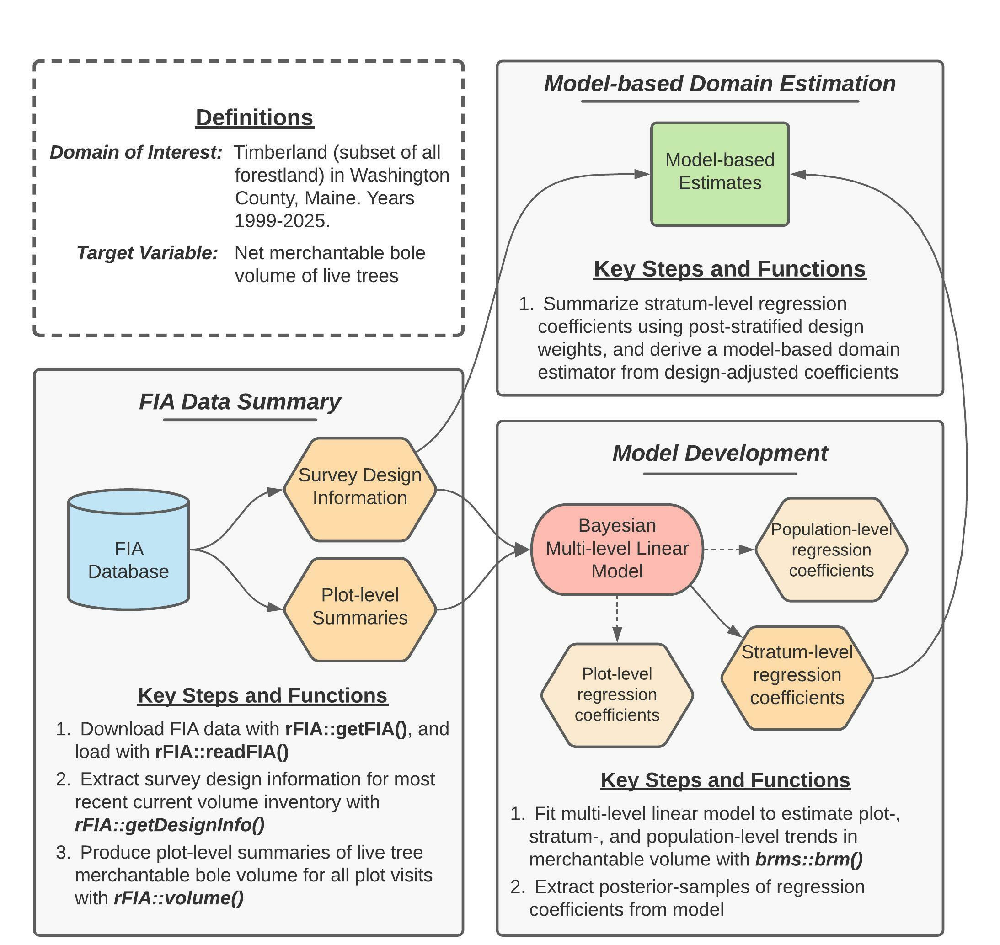

```{r setup, include=FALSE}
knitr::opts_chunk$set(echo = TRUE)
```

# Introduction

The purpose of this document is to provide a detailed tutorial of the code used to implement the second case study presented in Stanke, Finley, Domke (2021), “Simplifying small area estimation with rFIA: a demonstration of tools and techniques”. In this case study, we develop a temporally-explicit unit-level estimator of trends in merchantable wood volume in Washington County, Maine, using a Bayesian multi-level linear model and data collected by the USFS Forest Inventory and Analysis (FIA) Program.

``` {r, echo=FALSE, fig.align='center', out.width='88%'}

```

Figure 2 (reprinted above for convenience) provides a concept map illustrating key steps, functions, and workflows used to estimate multi-decadal trends in merchantable wood volume in Washington County. Here, blue cylinders represent data inputs, orange hexagons represent intermediate data products, red ovals represent models, and green rectangles represent domain estimates.

In words, this process consists of four primary stages: 

1. Extract survey design information associated with the most recent "current volume" inventory in Maine.
2. Produce plot-level summaries of merchantable wood volume for all FIA plot visits within our domain of interest (i.e., timberland in Washington county, years 1999-2025).
3. Fit a Bayesian multi-level linear model to estimate plot- and stratum-level mean merchantable wood volume conditional on time, accounting for repeated observation of plots.
4. Summarize regression coefficients estimated by the model using post-stratified design weights, yielding a robust model-based estimator of temporal trends in total merchantable wood volume for our domains of interest.

Finally, we evaluate the performance of our model by comparing model-based population estimates to annual, post-stratified estimates (design-based) for the same population over the period 1999-2019.

# Getting Started

### Downloading code and data from GitHub
Data and code required to replicate our workflows are available on [GitHub](https://github.com/hunter-stanke/FGC_rFIA_SAE). If you are familiar with Git, simply clone this repository on your local machine to get started. If you are not familiar, click on the `Code` dropdown in the upper-right hand corner of the landing page [here](https://github.com/hunter-stanke/FGC_rFIA_SAE) (just left of the `About` section), and you can download the full repository as a zip file.  

__*Important:*__ we house code and data associated with both case studies presented in this manuscript in the GitHub repository referenced above. Everything you need for this case study (estimating trends in merchantable volume in Washington County, Maine) can be found in the `vol/` directory. 

   + Source code is located in `vol/src/`
   + FIA data are downloaded from FIA's public server by `getFIA.R`. These data will be stored in the `vol/data/` directory once downloaded. You only need to download once, as data will be saved on disk.
   + Results (i.e., population estimates and plot-level summaries) generated by source code are stored in `volume/results/`
   + *To run*: source in the following order (1) `getFIA.R`, (2) `pltSummaries.R`, (3) `fitModel.R`, and (4) `annualPanels.R`. 


### Installing dependencies
The analyses detailed herein are conducted using the R programming language, and hence require a working installation of R (version 4.0.0 or newer). You can find instructions and tutorials for install R [here](https://rstudio-education.github.io/hopr/starting.html). In addition to base R, the following add-on packages are required: rFIA, dplyr, tidyr, brms, stringr, and here. These packages (and their respective dependencies) can be installed with:
``` {r, echo = TRUE, eval = FALSE}
## Install dependencies
install.packages(c("rFIA", "dplyr", "tidyr", "brms","stringr", "here"))

## Load packages
library(rFIA)
library(dplyr)
library(tidyr)
library(brms)
library(stringr)
library(here)
```


### Downloading FIA data
Next, we must download an appropriate subset of the FIA Database from the [FIA DataMart](https://apps.fs.usda.gov/fia/datamart/CSV/datamart_csv.html). The easiest way to accomplish this is using the `getFIA()` function from the rFIA R package. In the code that follows, we download the subset of the FIA Database for Maine, and save these data to a local directory on our computer (*your-project-directory*/vol/data/FIA/):
``` {r, echo = TRUE, eval = FALSE}
## Download/save FIA data for Maine (ME)
rFIA::getFIA(states = c('ME'),
             dir = here::here('vol/data/FIA/'),
             load = FALSE)
```

### Loading FIA data into R
Before we can use rFIA's estimator functions (e.g., `volume()`), we must first use `readFIA()` to load our FIA data into R, or alternatively, set up a "remote" FIA data object. This "remote" option is particularly useful when our area(s) of interest span multiple states, as it allows rFIA's estimator functions to split FIA data into small chunks and process each individually, thereby allowing us to work with large amounts of FIA data without overloading our computer's RAM. 

As we are only working with a single state here, we elect to read FIA data into memory immediately by specifying `inMemory=TRUE` (default) in the call to `readFIA()`:
``` {r, eval=FALSE, echo=TRUE}
db <- rFIA::readFIA(dir = here::here('volume/data/FIA'),
                    inMemory = TRUE)
```
where `dir` references the directory where we have saved the FIA data we downloaded with `getFIA()` (example above).


# FIA data summary
In order to fit ourmodel, we must first compile a dataset that details (1) assignment of plot locations in stratum and (2) merchantable wood volume observed at each plot visit.

### Extracting survey design information 
We begin by extracting survey design information for the most recent "current volume" inventory in Maine using the `getDesignInfo()` function from rFIA. The resulting data object (`wgts`) contains stratum weights (i.e., proportion of estimation unit represented by each stratum), estimation unit areas (i.e., total area of target populations), and plot-stratum assignments (i.e., which plots belong to which strata).
``` {r, eval=FALSE, echo=TRUE}
wgts <- rFIA::getDesignInfo(db, 
                            type = 'VOL',
                            mostRecent = TRUE)
```

Now that we know which plot locations have been included in the most recent "current volume" inventory (including both forested and non-forested plots), we will generate a list of all visits to these plots since the onset of the annual FIA inventory (i.e., since 1999):
``` {r, eval=FALSE, echo=TRUE}
plt.visits <- db$PLOT %>%
  # Replicate the unique plot ID (`pltID`) from rFIA
  dplyr::mutate(pltID = paste(UNITCD, STATECD, 
                              COUNTYCD, PLOT, 
                              sep = '_')) %>%
  # Select plots from inventory of interest
  dplyr::filter(pltID %in% wgts$pltID) %>%
  # Drop any visits pre-1999
  dplyr::filter(MEASYEAR >= 1999) %>%
  # Only retain ID columns
  dplyr::select(pltID, YEAR = MEASYEAR)
```

Next, we "expand" our dataset containing plot-stratum assignments (`wgts`) by joining on our list of visits made to these plots (`plt.visits`). Each row in `wgts` represents a single plot *location*, while each row in `plt.visits` represents a single *visit* to a plot location. Hence, joining `plt.visits` onto `wgts` (via a left join) will effectively duplicate stratum-assignments associated with plot *locations* for all plot *visits*, and the resulting data object (`mod.dat`) will form the "backbone" of the dataset that we will feed to our model, i.e., we simply need to add a response variable and predictors.
``` {r, eval=FALSE, echo=TRUE}
mod.dat <- wgts %>%
  # Drop YEAR from `wgts`, as it represents reporting years, 
  # as opposed to measurement years of plots, which is 
  # represented as YEAR in `plt.visits'
  dplyr::select(-YEAR) %>%
  # Expand `wgts` to include all visits to each plot location
  dplyr::left_join(plt.visits, by = 'pltID')
```

### Generating plot-level summaries of merchantable wood volume
We produce summaries of merchantable net bole volume for each visit to FIA plots in our area of interest using the `volume()` function in rFIA. In the code below, `byPlot=TRUE` indicates to rFIA that we would like to produce plot-level summaries as opposed to population estimates, and `areaDomain = UNITCD == 1` specifies our spatial domain of interest, where `UNITCD` is a unique code representing FIA's survey units (defined in the FIA database), and `UNITCD` 1 represents Washington County. Finally, `landType = "timber"` indicates that we would like to restrict our land basis to timberland, as opposed to all forestland (i.e., all plots on non-timber forestland will receive values of zero). 
``` {r, eval=FALSE, echo=TRUE}
plt.vol <- rFIA::volume(db,
                        byPlot = TRUE,
                        areaDomain = UNITCD == 1,
                        landType = 'timber')
```

Importantly, rFIA estimator functions will only return plot-level summaries for forested plots (no visits to non-forested plots are returned). Since our model-based estimation approach requires that both forested and non-forested plots be considered and our model dataset (`mod.data`) contains both forested and non-forested plots, when we join on the output of `volume()` (from above), we will have `NA`s listed in our response variable (`BOLE_CF_ACRE`) for non-forested plots. In these instances, we replace `NA` with 0: 
``` {r, eval=FALSE, echo=TRUE}
mod.dat <- mod.dat %>%
  ## Join response variable onto plot-visit dataset
  dplyr::left_join(dplyr::select(plt.vol, pltID, PLT_CN, BOLE_CF_ACRE),
                   by = c('pltID', 'PLT_CN')) %>%
  # Replace any NA's (indicating non-forested plots) with 0s
  tidyr::replace_na(list(BOLE_CF_ACRE = 0)) 
```


### Dropping unnecessary estimation units
Finally, we drop all estimation units that contain no non-zero observations of merchantable wood volume. For example, this includes estimation units that are outside of Washington County, and estimation units that are within Washington County, but are exclusively non-forested (e.g., census water).
``` {r, eval=FALSE, echo=TRUE}
mod.dat <- mod.dat %>%
  # An indicator that is positive when non-zero observations
  # are available within an estimation unit
  dplyr::group_by(ESTN_UNIT_CN) %>%
  dplyr::mutate(nonzero = sum(BOLE_CF_ACRE, na.rm = TRUE)) %>%
  dplyr::ungroup() %>%
  # Drop all data from unnecessary estimation units
  dplyr::filter(nonzero > 0) %>%
  # Simplify our data structure by dropping some columns
  dplyr::select(ESTN_UNIT_CN, AREA_USED, STRATUM_CN, 
                STRATUM_WGT, pltID, YEAR, BOLE_CF_ACRE)
```


# Model development
### Variable scaling
In preparation for model fitting, we convert units of our response variable from cubic feet per acre to cubic meters per hectare and scale our predictor (calender year) to facilitate interpretation of the intercept term:
``` {r, eval=FALSE, echo=TRUE}
mod.dat <- mod.dat %>%
  ## Group indicator variables must be factors
  dplyr::mutate(STRATUM_CN = as.factor(STRATUM_CN)) %>%
  ## Scale predictor and response
  dplyr::mutate(time = YEAR - 1999,
                # Converting ccf/acre to m^3/ha
                vol = BOLE_CF_ACRE / 35.315 * 2.471) 
```

### Setting priors
Next we set priors for our population-level regression coefficients ($\alpha$ and $\beta$), and their associated among ($\sigma_{\alpha_{h}}^2$ and $\sigma_{\beta_{h}}^2$) and within stratum variances ($\sigma_{\alpha_{hi}}^2$ and $\sigma_{\beta_{hi}}^2$), and for the residual variance of the model. All priors have been designed to be weakly informative:
``` {r, eval=FALSE, echo=TRUE}
priors <- c(
   # Population-level regression coeffients
   brms::prior(normal(50, 250), 
               class = Intercept), 
   brms::prior(normal(0, 100), 
               class = b,
               coef = time), 
   
   # Among- and within stratum standard deviation of coefficients
   # These cover both alpha and beta
   brms::prior(student_t(3, 0, 100), 
               class = sd, 
               group = STRATUM_CN), # Across strata
   brms::prior(student_t(3, 0, 100),
               class = sd, 
               group = pltID:STRATUM_CN), # Within stratum
   
   # Residual standard deviation
   brms::prior(student_t(3, 0, 100), 
               class = sigma)
)
```

### Fitting the model
Finally, we estimate our model using the `brms` package, which can be used to fit a wide variety of Bayesian models using a common syntax (mirrored from popular mixed-modeling packages, like `lme4`). 

We simulate three Markov chains (`chains=3`), for a total of 4000 iterations per chain (`iter=4000`). Of these 4000 iterations, the first 2000 are discarded as burn-in iterations (`warmup=2000`), and every second iteration of the remaining 2000 is discarded to reduce within-chain correlation (`thin=2`). 
``` {r, eval=FALSE, echo=TRUE}
## Model formula
mod.form <- brms::bf(
   vol ~ time + (time | pltID:STRATUM_CN) + (time | STRATUM_CN)
   )

## Fit model
mod <- brms::brm(mod.form,
                 data = mod.dat,
                 family = gaussian,
                 prior = priors,
                 chains = 3,
                 iter = 4000,
                 warmup = 2000,
                 thin = 2,
                 backend = "cmdstanr")
```


\hfill\break

# Model-based domain estimation
To generate model-based estimates of total merchantable wood volume for our domains of interest, we must (1) extract posterior samples of stratum-level regression coefficients from our model, (2) adjust these stratum-level coefficients with post-stratified design weights and summarize into adjusted population-level coefficients, and (3) use resulting population-level coefficients to predict total merchantable wood volume on an annual basis. 

### Extract model coefficients
To begin, we extract posterior samples of stratum-level regression coefficients from our model. The code for this step may appear complicated, but is required to get posterior samples into a tidy format, where each row represents a single posterior sample draw of $\alpha_h$ or $\beta_h$, and there are a total of 3000 posterior samples (rows) for each parameter. 
```{r, eval=FALSE, echo=TRUE}
alpha <- coef(mod, summary = FALSE)$STRATUM_CN[,,1] %>% 
  t() %>% 
  as.data.frame() %>%
  `names<-`(paste0('iter', 1:3000)) %>%
  dplyr::mutate(STRATUM_CN = as.factor(row.names(.))) %>%
  tidyr::pivot_longer(cols = -c(STRATUM_CN), n
                      ames_to = 'iter',
                      values_to = 'alpha') %>%
  dplyr::mutate(iter = stringr::str_sub(iter, 5, -1))
beta <- coef(mod, summary = FALSE)$STRATUM_CN[,,2] %>%
  t() %>% 
  as.data.frame() %>%
  `names<-`(paste0('iter', 1:3000)) %>%
  dplyr::mutate(STRATUM_CN = as.factor(row.names(.))) %>%
  tidyr::pivot_longer(cols = -c(STRATUM_CN), 
                      names_to = 'iter',
                      values_to = 'beta') %>%
  dplyr::mutate(iter = stringr::str_sub(iter, 5, -1))

## Clean table of estimated coefficients at every iteration
params <- dplyr::left_join(alpha, beta, by = c('STRATUM_CN', 'iter')) 
```


### Adjust stratum-level regression coefficients with design weights
Next, we summarize posterior samples of our stratum-level regression coefficients using stratum weights from FIA's post-stratified design (according to Eqs 12-13 in the manuscript). First, we produce a simplified table of estimation unit areas and stratum weights (stratum area / estimation unit area) for all estimation units in our area of interest:
``` {r, eval=FALSE, echo=TRUE}
## Simplified survey design info with stratum and 
## estimation unit areas
design.info <- mod.dat %>%
  dplyr::select(ESTN_UNIT_CN, AREA_USED,
                STRATUM_CN, STRATUM_WGT) %>%
  dplyr::distinct()
```

We then join this table containing stratum weights (`design.info`) onto our data object containing posterior samples of $\alpha_h$ or $\beta_h$ (`params`). We take a weighted average of $\alpha_h$ and $\beta_h$ within estimation units to generate our design-adjusted population-level regression coefficients for each estimation unit (where stratum weights define relative weights in the weighted average). 
``` {r, eval=FALSE, echo=TRUE}
## Adjust population-level coefficients with design weights
adj.coef <- params %>%
  dplyr::left_join(design.info, by = 'STRATUM_CN') %>%
  ## Weighted average across strata
  ## Equivalent to imputing the mean to 
  ## all population units at time t
  dplyr::group_by(iter, ESTN_UNIT_CN, AREA_USED) %>%
  dplyr::summarize(alpha = sum(alpha * STRATUM_WGT),
                   beta = sum(beta * STRATUM_WGT)) 
```
Finally, we multiply our design-adjusted population-level regression coefficients by the total area of each estimation unit, and sum the resulting values across estimation units, thereby weighting by the relative size of estimation units within Washington County. Importantly, multiplying regression coefficients by the total area of estimation units also allows us to make predictions of the population total, as opposed to the population mean:
``` {r, eval=FALSE, echo=TRUE}
adj.coef <- adj.coef %>%
  ## Convert to population total for each estimation unit
  dplyr::mutate(alpha = alpha * AREA_USED,
                beta = beta * AREA_USED) %>%
  ## Sum across estimation units
  dplyr::group_by(iter) %>%
  dplyr::summarize(alpha = sum(alpha),
                   beta = sum(beta)) %>%
  dplyr::ungroup() 
```


### Predict total merchantable wood volume over 1999-2025
Now we can use our design-adjusted regression coefficients to produce annual estimates of total merchantable volume in Washington County following Eqs 14-15 in the associated manuscript. Remember that we re-scaled our variable representing time of plot visit to equal zero in 1999, and hence must use the same scale when make predictions from our model. 
``` {r, eval=FALSE, echo=TRUE}
pred.list <- list()
for (i in 1999:2025) {
  pred.list[[as.character(i)]] <- adj.coef %>%
    dplyr::mutate(YEAR = i,
                  BOLE_CM_TOTAL = alpha + beta * (i - 1999))
}
## Predicted population totals at each year over 1999-2025
totals <- dplyr::bind_rows(pred.list)
```
Importantly, the `totals` data object contains annual predictions of total merchantable wood volume made from each posterior sample of our regression coefficients, i.e., we end up with 3000 predictions for each year over the period 1999-2025 (1000 posterior samples per chain, times three chains). 

We can summarize across posterior samples to produce point estimates (median of posterior samples) and associated indices of uncertainty (standard deviation and 2.5%/97.5% percentiles of posterior samples):
``` {r, eval=FALSE, echo=TRUE}
totals.summary <- totals %>%
  dplyr::group_by(YEAR) %>%
  dplyr::summarize(BOLE_CM_TOTAL_VAR = var(BOLE_CM_TOTAL),
                   BOLE_CM_TOTAL_2.5 = quantile(BOLE_CM_TOTAL, 0.025),
                   BOLE_CM_TOTAL_97.5 = quantile(BOLE_CM_TOTAL, 0.975),
                   BOLE_CM_TOTAL = median(BOLE_CM_TOTAL))
```


# Post-stratified domain estimation
We can produce corresponding annual (indicated by `method="annual"`), post-stratified estimates of total merchantable wood volume in Washington County using the `volume()` function in rFIA:
``` {r, eval=FALSE, echo=TRUE}
ps.totals <- rFIA::volume(db,
                          landType = 'timber',
                          areaDomain = UNITCD == 1,
                          method = 'annual',
                          totals = TRUE,
                          variance = TRUE)
```
where `BOLE_CF_TOTAL` gives annual estimates of net merchantable bole volume in cubic feet per acre, and `BOLE_CF_TOTAL_VAR` gives the associated variance of the estimate of the population total. For comparison to our model-based estimates, we must first convert cubic feet per acre to cubic meters per hectare:
``` {r, eval=FALSE, echo=TRUE}
ps.totals <- ps.totals %>%
  dplyr::mutate(BOLE_CM_TOTAL = BOLE_CF_TOTAL / 35.315*2.471,
                BOLE_CM_TOTAL_VAR = BOLE_CF_TOTAL_VAR / (35.315*2.471)^2)
```


